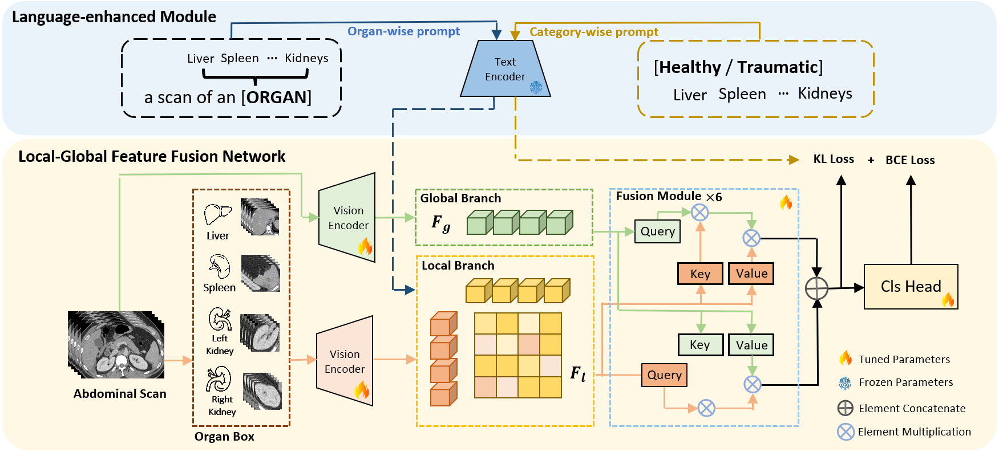

# Language-enhanced Local-global Aggregation Network for Multi-organ Trauma Detection

## Introduction
Pytorch implementation for MICCAI 2024 paper **[Language-enhanced Local-global Aggregation Network for Multi-organ Trauma Detection
](https://github.com/Jianxun98/LE-LGAN/)**

> Abdominal trauma is one of the leading causes of death in the early population and poses an increasing global challenge. However, interpreting CT scans for abdominal trauma poses considerable challenges for deep-learning models. Trauma may exist in multiple organs which have different shapes and morphologies. Additionally, a thorough comprehension of visual cues and various types of trauma is essential, demanding a high level of expertise. To address these issues, in this paper, we introduce a language-enhanced local-global aggregation network that fully utilizes both global contextual information and local organ-specific information inherent in images for accurate trauma detection. Furthermore, the network is enhanced by text embedding from Large Language Models (LLM). This LLM-based text embedding possesses substantial medical knowledge, enabling the model to capture anatomical relationships of intra-organ and intra-trauma connections. We have conducted extensive experiments on one public dataset RSNA Abdominal Trauma Detection (ATD) and one private dataset. Specifically, compared with other state-of-the-art methods, the F1-score of organ-level trauma detection improves from 51.4\% to 62.5\% when evaluated on the public dataset and from 61.9\% to 65.2\% on the private dataset, justifying the efficacy of our network in multi-organ trauma detection.

## Setup

## Data preparing
#### 1. Download the RSNA-ATD dataset: https://www.kaggle.com/competitions/rsna-2023-abdominal-trauma-detection/data

## Usage
### Training

### Testing

## Citation
For any questions, please contact ‘jianxyu98@gmail.com’
